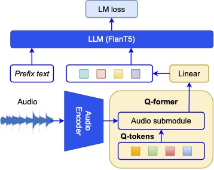

# About BLAP
We introduce BLAP, a model capable of generating high-quality captions for music. BLAP leverages a fine-tuned CLAP audio encoder and a pre-trained Flan-T5 large language model. To achieve effective cross-modal alignment between music and language, BLAP utilizes a Querying Transformer, allowing us to obtain state-of-the-art performance using 6x less data compared to previous models.
This is a critical consideration given the scarcity of descriptive music data and the subjective nature of music interpretation. 
We provide qualitative examples demonstrating BLAP's ability to produce realistic captions for music, and perform a quantitative evaluation on three datasets.
BLAP achieves a relative improvement on FENSE compared to previous models of 3.5\%, 6.5\%, and 7.5\% on the MusicCaps, Song Describer, and YouTube8m-MTC datasets, respectively.
We open-source the code and model weights in order to contribute to the broader accessibility and advancement of the music captioning field.

### Model Setup
<div style="text-align: center;">
  
</div>

## System Requirements
* Python version: 3.12

## Getting Started
We use [Poetry](https://python-poetry.org/) to manage the python libraries.

To install all the dependencies run `poetry install` in the main directory.

## Get The Model

You can find the checkpoint and configuration file of our model on [Huggingface](https://huggingface.co/Tino3141/blap/tree/main).


## Run The Model
Loading the Model
To load the BLAP2 Stage 2 model, you will need the checkpoint path and model configuration path.

```python
# Initialize the model
from blap.model.BLAP2.BLAP2_Pretrain import BLAP2_Stage2

ckpt_path = "path/to/your/checkpoint.ckpt"
modelConfig_path = "path/to/your/model/config.json"

blap_model = BLAP2_Stage2.from_checkpoint(
    checkpoint_path=ckpt_path,
    modelConfig=modelConfig_path,
)
```

```python
# Create captions
# Set the model to evaluation mode
blap_model = blap_model.eval()

# Prepare your audio data (example here is a numpy array)
# Ensure the audio is in shape (samples, 4800000) with a sampling rate of 48 kHz
audio_data = ...  # Your 10-second audio data as a numpy array

# Convert the audio data to a tensor and reshape it to the correct input shape
audio_tensor = torch.tensor(audio_data).reshape(1, -1).float()

# Generate the caption for the audio data
with torch.no_grad():
    output = blap_model.predict_answers(
        audio_tensor,
        "Provide a music caption for this audio clip. Do not mention audio quality",
        max_len=40,
        min_len=30,
        num_beams=10
    )

# Print the generated caption
print("Generated Caption:", output[0])
```